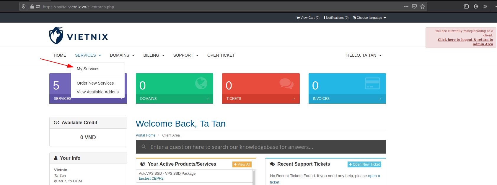
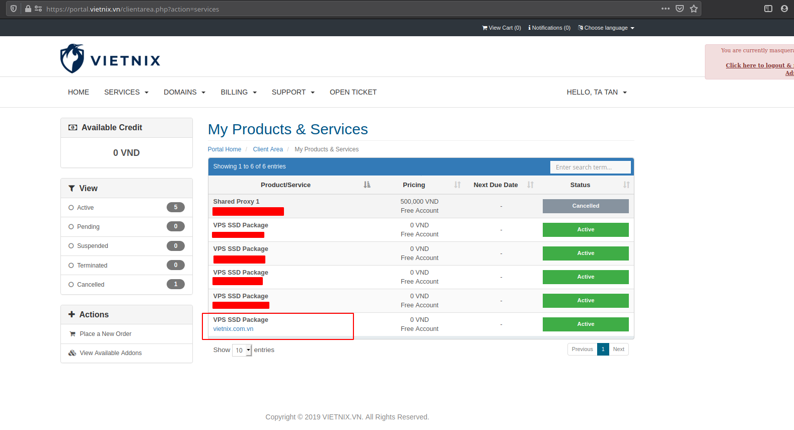
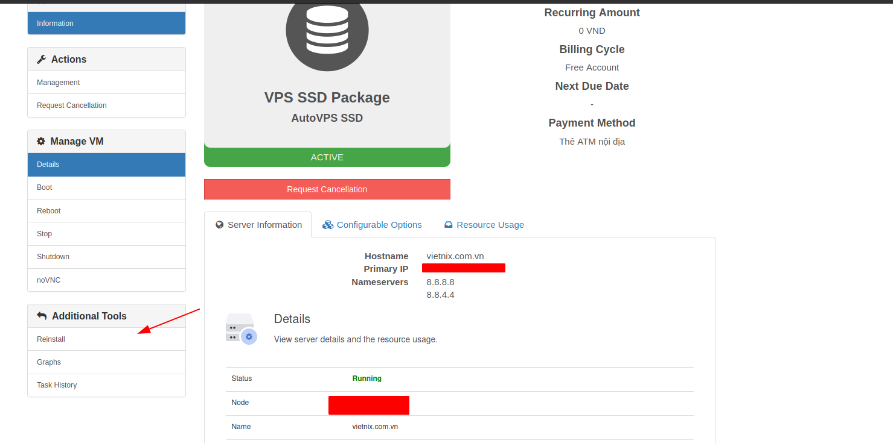
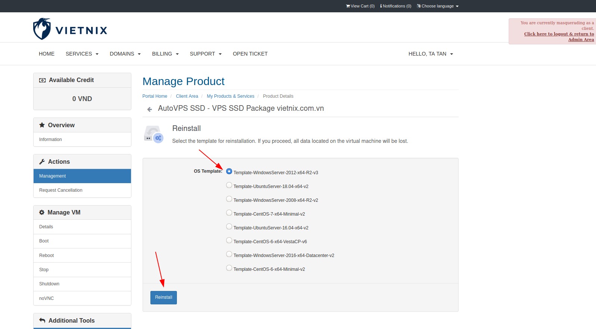
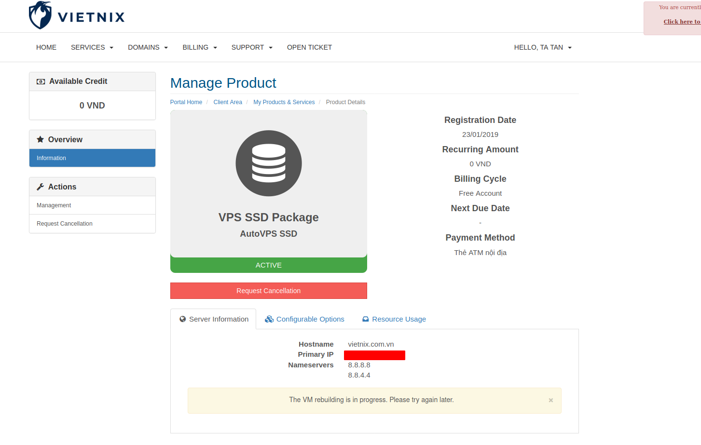
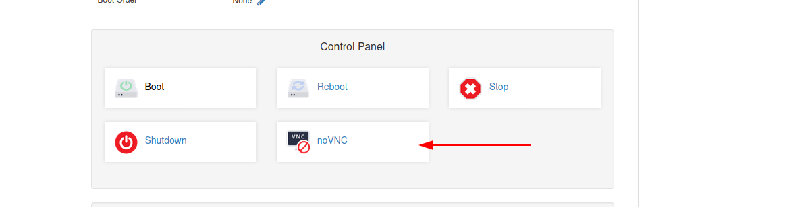
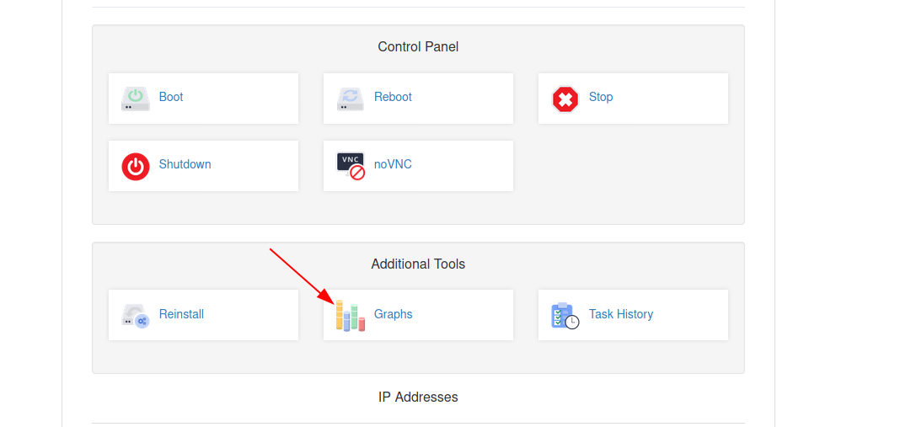
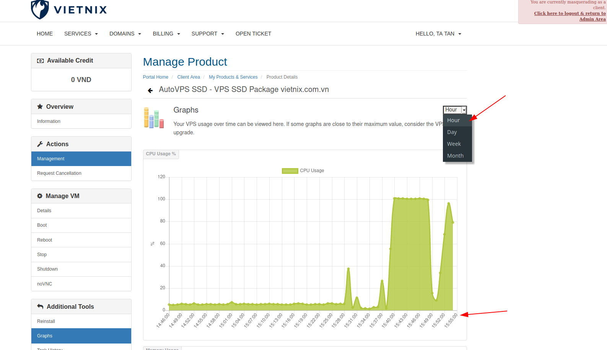

## Hướng dẫn sử dụng các tính năng của dịch vụ auto vps của Vietnix

### Bài viết sau hướng dẫn Quý khách hàng sử dụng các tính năng của dịch vụ auto vps tại Vietnix.

### I. __Hướng dẫn tính năng resintall vps__
__Bước 1: Login vào giao diện portal dành cho client__
```
https://portal.vietnix.vn/clientarea.php
```
Truy cập vào __My services__ 



__Bước 2: Chọn vps cần cài lại__


__Bước 3:Chọn vào chức năng resintall và chọn OS cần cài lại__



__Lưu ý: Chổ cài lại vps này IP và mật khẩu sẽ giống với thông tin ban đầu Vietnix gửi cho quý khách hàng.__

__Bước 4: Chờ đợi vps cài lại trong vài phút__


### II.__Các tính năng khác của dịch vụ auto vps tại Vietnix.__
Ngoài các tính năng start,stop và reboot vps. Cụm auto vps của Vietnix còn hỗ trợ các tính năng sau: 

__1.Tính năng VNC__

VNC có gì hay hơn là Remote trên Windows và SSH trên Linux.

Khi sử dụng VNC chúng ta có giao diện và thao tác giống như là đang ở trên máy tính. Cho dù vps này có ra mạng được hay không ta vẫn có thể login vào và kiểm tra lại vps của mình.


__2.Tính năng Graphs__

Tính năng này sẽ cho quý khách hàng theo dõi được tình trạng CPU, RAM và network của vps mình theo từng thời điểm trong ngày.


Cụ thể từng thời điểm mà quý khách hàng kiểm tra vps mình có chạy ổn định có sự cố nào với vps mình.



